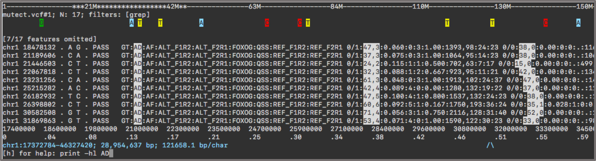

New in 1.18.0
=============

* Add configuration parameter `low_mapq` to set what you consider as low
  mapping quality. Default is 5 which is the setting hardcoded until now.

* Use *false* in config `shade_structural_variant` to omit shading of
  structural variants 

New in 1.17.0
=============

* `print` shows column separated by green `|` (more readable)

* BEDGRAPH format is an extension of BED. This means lines in bedgraph lines can be printed with `print` and filtered with `grep` & `awk`

* Add command `bedToBedgraph` to switch from BED to BEDGRAPH and viceversa

* Speed improvements to filtering with `awk`

* Command line argument `--showMemTime` replaces `--showMem` and `--showTime`

New in 1.16.0
=============

* **Important** Reading TDF, bigWig, and bigBed from remote URL is no longer possible; local
  files are ok. This is because the new API of htsjdk is incompatible with IGV
  v2.6. Upgrading IGV is causing problems between theirs and our custom htsjdk.

* `print -hl` command can highllight by column position, *e.g.* `print -hl '$3,
  $10'`

* Can use CSI index for BAM files.

* `featureColorForRegex`, renamed to `featureColor`, now accepts as expression
  a regex (as before) or an awk script. Awk is useful to color features
  according to some numeric values. *E.g.*, in a narrowPeak file you can
  highlight features with qvalue > *x*: `featureColor -r '$9 > 3' blue -r '$9 >
  6' red`

* Quoting: in addition to **single quotes**, command arguments can be delimited
  by **double quotes** `"`, **tripe single quotes** `'''` or **triple double
  quotes** `"""` (similar to python). For example, grep records containg single
  quotes: `grep -i "'" or grep -i """'"""`

* Add navigation commands [\[ and
  \]](http://asciigenome.readthedocs.io/en/latest/commandHelp.html#open_bracket)
  to move window by screen column.

* File path in track title is shown as relative to current working directory
  and simplified.
  
* `gffNameAttr` can rename also bed features. It has been renamed to the more
  comprehensive `nameForFeatures`. The name to display for bed feature can be
  assigned by passing to `nameForFeatures` the column index to use. This is
  particularly useful to show metrics of interest in *e.g.* narrowPeak peak
  files. 

* Document the special flag 4096 in `samtools` command which selects for TOP
  STRAND reads.  Useful for stranded RNA-Seq and BS-Seq libraries.

* `orderTracks` can put selected tracks last. First select all tracks with e.g.
  `.`, then list those you want last: `orderTracks . #1 #2`

* [goto](https://asciigenome.readthedocs.io/en/latest/commandHelp.html#goto)
  understands target region separated by spaces (issue #93). Useful to copy and
  paste regions from tables text files. *E.g.*, `goto chr7 10 200`.

New in 1.15.0
=============

* Change behaviour of `bookmark` command. The argument to bookmark the region can have the chromosome prefix `<chr>:` omitted. 
In such case, use the current chromosome. The command `bookmark 100` will bookmark position 100 on current chromosome while
`bookmark chr1` will fail instead of bookmarking the entire chromosome.  

* Command help can be invoked also with `?my_cmd` or `help my_cmd`

* Various issues fixed

New in 1.14.0
=============

**Java version 1.8 is now required**

* Update htsjdk to version [2.14](https://github.com/samtools/htsjdk/tree/1bbd3cf3885d897b03fdb5369cc6bb4736c52538). 
As before, htsjdk has been modifed to be more lenient on input validation. 
See [here](https://github.com/dariober/htsjdk) and `build.gradle` for the exact version loaded.
IGV package also updated to 2.4.10.   

* Fixed bug causing base quality shading to shift right with soft clipping.

* Fixed bug in checking latest version on repository.

* Fix reading configuration file from command line.

* Fix an off-by-one error in `find` command with indels.

* Fix at least some issues running on Windows have been fixed (see [issue#83](issue
  [#55]https://github.com/dariober/ASCIIGenome/issues/55)).

New in 1.13.0
=============

* Commands `INT` and `PERCENT` accept the suffix `c` to put the position INT or PERCENT right at the center of the screen. 
Followed by the command `zi` or `zo`, this is useful to quickly zoom-in into a peak or variant of interest.

* The highlighting of the mid-character in read tracks can be turned off `setConfig highlight_mid_char false`.  

* Fixed bug where Stopwatch in `TrackProcessor` was started when already running. This happened after an uncaught exception.

* Fixed in `print -hl` causing an out-of-bound index accessing VCF samples with incomplete fields.

* New command [reload](http://asciigenome.readthedocs.io/en/latest/commandHelp.html#reload) updates the current view after a file has been modified. This is useful when you are 
experimenting with files and you want to quickly see them updated in *ASCIIGenome*.

* Reads can be shown as `>` and `<` chracters also at single base resolution via configuration key `nucs_as_letters`.

* Second-in-pair reads are shown underlined also when base pair resolution is greater than 1.

* Easier setting of configuration. The configuration key is fuzzy matched so it doesn't have to be spelt in full.

* [print](http://asciigenome.readthedocs.io/en/latest/commandHelp.html#print) has option `-esf` to explain SAM flags.

* Fix minor bug: `%r` in `save` command is expanded to `chr_from_to`, consistent with save in `print`. Before `%r` expanded to `chr_from-to`. 
gg
* Enable comments in command line with `//`. E.g `goto chr1 // A comment`

Refactor
--------

* ASCIIGenome project refactored to use the [gradle](https://gradle.org/) built tool.

* Add continuous integration via [Travis CI](https://travis-ci.org/dariober/ASCIIGenome) 

* Add code coverage via [codecov](https://codecov.io/gh/dariober/ASCIIGenome)

New in 1.12.0
============

Bug fixes
---------

* Fixed bug where initialisation failed with VCF or SAM files with no records.

* Fixed bug causing (some) tracks to be processed even when their height was set to zero. 

* Temporary files are written to the current dir by default and only as a fallback to the system's tmp directory. 
This is to reduce the risk of filling up the `/tmp/` partition, which usually is quite small.

* [find](http://asciigenome.readthedocs.io/en/latest/commandHelp.html#find) explicitly 
informs the user that no match was found when the searched pattern returns no matches.
   

New features
------------

* Command [filterVariantReads](http://asciigenome.readthedocs.io/en/latest/commandHelp.html#filtervariantreads) correctly interprets cigar operators `=` and `X`.

* Command [filterVariantReads](http://asciigenome.readthedocs.io/en/latest/commandHelp.html#filtervariantreads) intreprets intervals and offsets. *E.g.*
`filterVariantReads -r 1000+/-10` or `filterVariantReads -r 1000+10`. **NB** In contrast to v1.11.0, select an interval using colon `-r from:to`. The minus `-` sign will subtract
the offset from the first positions.

* Add `-all` option to [filterVariantReads](http://asciigenome.readthedocs.io/en/latest/commandHelp.html#filtervariantreads) 
to retain all reads intersecting interval, not just the variant ones.

* [awk](http://asciigenome.readthedocs.io/en/latest/commandHelp.html#awk) includes a built-in function, `get(...)`, to retrieve GFF, GTF, SAM or VCF attribute tags from the respective files. 

* [print](http://asciigenome.readthedocs.io/en/latest/commandHelp.html#print) rounds numbers to *n* decimal places via the `-round` option. In this
way the printed lines are more readable.   

* `-clip` mode in [print](http://asciigenome.readthedocs.io/en/latest/commandHelp.html#print) gives more readable output. 
Long SEQ and QUAL fields in bam reads and long REF and ALT sequences in vcf are also clipped. 
since typically you don't want to read long sequences and quality strings. Also long strings like Oxford Nanopore or PacBio CIGAR strings 
are shortened. `-full` mode still returns whole shebang which combined with `print -sys 'cut ...'` (or similar) gives readable output.

* `-hl` option in [print](http://asciigenome.readthedocs.io/en/latest/commandHelp.html#print) can highlight matches to a regular expression, similar to vim `/` or
(`CTRL-F` / `CMD-F` in many GUI programs). In addition, regexes matching a FORMAT tag in VCF records highlight the tag AND the corresponding values. 
This is useful to quickly scan a sample property across samples. For example, here we highlight the AD format tag in two samples:

  

* Command `addTracks` renamed to more conventional [open](http://asciigenome.readthedocs.io/en/latest/commandHelp.html#open). 
`addTracks` is still recognized as an alias.

* Invalid bedgraph records are silently skipped. This is to allow tables with *NA* or similar to be loaded. 

* [setGenome](http://asciigenome.readthedocs.io/en/latest/commandHelp.html#setGenome) executed without arguments (tries to)
load the last opened fasta file.

* [find](http://asciigenome.readthedocs.io/en/latest/commandHelp.html#find) and 
[grep]([setGenome](http://asciigenome.readthedocs.io/en/latest/commandHelp.html#grep)) now match in **case insensitive** 
mode by default. Use flag `-c` to enabled case sensitivity. In addition, flag `-F` matches literal strings, not regex.

* New command [explainSamFlag](http://asciigenome.readthedocs.io/en/latest/commandHelp.html#find) to quickly make sense of SAM flags. Similar to 
[picard/explain-flags](https://broadinstitute.github.io/picard/explain-flags.html). Example:

```
[h] for help: explainSamFlag 99 173 3840

99 173 3840                                                                    
 X  X   .    read paired
 X  .   .    read mapped in proper pair
 .  X   .    read unmapped
 .  X   .    mate unmapped
 .  .   .    read reverse strand
 X  X   .    mate reverse strand
 X  .   .    first in pair
 .  X   .    second in pair
 .  .   X    not primary alignment
 .  .   X    read fails platform/vendor quality checks
 .  .   X    read is PCR or optical duplicate
 .  .   X    supplementary alignment
```

* Present a suggestion when a misspelt command is issued. E.g.: 

```
[h] for help: prnt                                                                                                                                                                   
Unrecognized command: prnt                                                                                                                                                           
Maybe you mean print?                                                                                                                                                                
```

New in 1.11.0
============

Speed
-----

A few improvements to increase speed

* Speed improved in printing tracks of bam alignments. Depending on the file system, the improvement can be 
  quite large, now taking milliseconds instead of seconds. Explanation: The library size of a bam file was 
  recalculated each time the screen was refreshed. This can be very fast on some systems but on others 
  it can take up to a few seconds.

* Following from previous point: library size is not calculated by default. This can make ASCIIGenome
  faster in loading bam files.

* Some speed improvement in processing BAM tracks. The improvement is more noticeable when 
  loads of reads are processed. For example, a window spanning 85 kb and containing ~2 million reads
  takes ~35 sec in this version compared to ~1:30 min in v1.10.0.  

* Pileup data is cached so that it doesn't need to be recalculated. This makes commands like `f/b/ff/bb` and `zi` 
  much faster. 

* Setting a reference fasta sequence via `-fa` or `setGenome` is faster due to *lazy loading* of reference
 sequence. *I.e.*, a sequence is retrieved from file only if requested. The speed advantage may or may not be noticeable, 
 depending on filesystem.

Bug fixes & additions
---------------------

* New command `filterVariantReads` selects reads with a mismatch in a given reference position. Useful to
inspect reads supporting alternate alleles.  

* Fix bug where shaded base qualities were occasionally shifted.

* Insertions in reads are visible. The base preceding an insertion has fore/background colour inverted.

* Re-established compatibility with Java 1.7. Release 1.10.0 was accidently compiled for Java 1.8.

* Validation of VCF files is more relaxed. The original validation imposed by htsjdk is very stringent
  causing files to be rejected for minor bugs.

* `genotype` matrix prints samples in the same order as in the VCF instead of using alphanumeric order.

* Indel variants start from POS+1 if the first base of the variant equals the reference.

* `grep` applies also to bam tracks.

* Add `-c` option to `next` command. Useful for browsing small features such as SNV and indels.


New in 1.10.0
============

There are several additions in this release:

* VCF: better representation of structural variants. Previous versions had very limited support for SV. 

* `readsAsPairs` command can show paired-end reads joined up.

* `featureColorForRegex` can set colour for features NOT matching a regex. Useful to dim features without 
completely hiding them.

* `awk` recognises column headers for bam, vcf, gtf/gff, bed tracks, like `$POS $START $FEATURE` etc, similar to [bioawk](https://github.com/lh3/bioawk).

* A pair of single quotes (`''`) at the command prompt is understood as an empty argument. 

* SAM and BAM files without index are now acceptable input. They are sorted and indexed to temporary file and then loaded (this of course can take 
a long time for large files).

* `addTracks` accepts a list of file indexes pointing to the list of recently opened files.


New in 1.9.0
============

* New command `featureColorForRegex` sets custom colour of individual features.

* Add command `PERCENT [PERCENT]` to zoom into a region on the current 
window. E.g. `.25 .5` moves to the second quarter of the current 
window. This command deprecates the use of suffix `c` in command command `INT [INT]`. 

* On exit via `q` command the screen is cleared. This avoids leaving the the screen in mixed colours. 

* Fixed some minor bugs.

New in 1.8.0
============

* Transcript names (or in general feature names) for GTF files can be set via `gffNameAttr` (Fix issue 74).

* There should be a mild improve in speed, especially at start up, due to building the
  jar with libraries *extracted* instead of *packaged*.   

New in 1.7.0
============

* Add `setConfig` command to set individual global parameters. Still rough but usable.

* Add ruler showing the column number on the terminal. The column numbers are used by the `INT INT` command
  to zoom in the region spanned by the given column numbers. This is useful to 
  jump to a specific region within the current genomic window without having to type 
  the long string of genomic coordinates.

* Genomic ruler shows rounded numbers.

* Reads with skipped regions (cigar operator: N) show the gap also when the resolution
is greater than single base.

* Change some defaults in `metal.conf` configuration.

* Fixed bug introduced in 1.6.0 with resizing window.

New in 1.6.0
============

* `print` command takes option `-sys` to execute system command to parse the raw lines
  before printing.

* Fixed bug on rpm conversion in pileup track.

New in 1.5.0
============

This release fixes some important bugs and adds new features.

* Issue #67 is fixed.

* `Awk` has been extended to read tracks so that sam records can be filtered using `awk` syntax.

* The central column is highlighted in read tracks to ease the eye-balling of variant bases.

* Low base qualities in reads are shaded grey.

* The title can be on the same line as the data provided it doesn't get on the way. This gives a more
  compact visualization especially with sparse data.

* The consensus display of consensus sequence is temporarily disabled (it'll come back).

New in 1.4.0
============

* `print` applies to bam files.

* Insertions in VCF files are represented as string of length equal to the insertion
  (at single base resolution, at larger zoom they scale accordingly). In previous 
  versions insertions have always length 1 which is more consistent with the genomic 
  coordinates but less useful.

* Completely changed the API of `bookmark` to be more useful and intuitive.
Adding and removing bookmarks can done by explicitly giving the coordinates
of interest. Default is still the current coordinates.

* Command line option `-g/--genome` has been removed. To set a genome right at the
  start use `-x setGenome hg19` (replace hg19 with a suitable input of course).

* Default colour theme is "metal".

* Fixed bug in pdf colours. Default back/foreground is taken from configuration 
  instead of being hard-coded white and black. 

New in 1.3.0
============

* Colour theme can be customized. Add `setConfig` command.

* Add command `sys` to execute system commands.

New in 1.2.1
============

Fixed issue [#55]https://github.com/dariober/ASCIIGenome/issues/55 and [#56](https://github.com/dariober/ASCIIGenome/issues/56)

New in 1.2.0
============

* Fixed important bug creating indexes for vcf files. 

* Positions visited in previous sessions of ASCIIGenome are now available in later sessions.
  Visited positions are written to the history file (`~/.asciigenome_history`) and retrieved
  at the start of ASCIIGenome.

* On exit check if a newer version is available on GitHub.

* Fixed silly off-by-one error with capturing regexes in `ylim`. Fixed issue #49 
  and #50.

* `posHistory` can limit the number of positions to print with the `-n` option.

* `next` takes optional argument `-zo` to set the zoom level.

* <ENTER> after a command with non-zero exit code returns the previous screenshot rather 
  than re-issuing a broken command. This is also useful to return to the genome view
  after executing valid commands with non-zero exit code such as `-h`, `history`, 'showGenome' etc.

New in 1.1.0
============

* `history` and `recentlyOpened` takes optional argument `-grep` and `-n`

* `colorTrack` supports all the 256 colours from the Xterm256 palette. The Xterm256
  is now the only palette used throughout ASCIIGenome.

* Introduced `awk` for advanced record filtering 

* Fixed bug where a string starting with '!' caused the JLine2 ConsoleReader to crash. 
  Fixed by setting `console.setExpandEvents(false)`

* Fixed (again!) bug where samtools filters for paired-end reads (*e.g.* -F 64) 
  applied to non-paired reads threw an `IllegalStateException`. Fixed by editing
  editing `~/eclipse/libraries/htsjdk/htsjdk-1.141/src/java/htsjdk/samtools/SAMRecord.java`
  to comment out the method throwing the exception (command line samtools doesn't mind such behaviour).
  htjdk was then recompiled and the jar file add to build path.
  This is a hack. If you upgrade htjdk remember to comment out `requireReadPaired`
  again. Remember also to make the recompiled htjsdk before igv htsjdk.
  This is the edit:

```
private void requireReadPaired() {
    // dariober edit
    //if (!getReadPairedFlag()) {
    //    throw new IllegalStateException("Inappropriate call if not paired read");
    //}
}
```

New in 1.0.0
============

This is expected to be a stable release. 

* Add utility to index fasta files


New in 0.6.0
============

* bigBed files supported.

* Pdf output replaces png output to save screenshots. This makes a lot more sense since
  we are saving text not paintings!

* Command history is saved to `~/.asciigenome_history` and reloaded on next start,
  so commands are "remembered", similar to shell history.

* Command `recentlyOpened` remembers files from previous sessions.

* Track heights at start are set to fill the height of terminal.

* `showGenome` is a bit more informative: It prints at least the known chromosomes if no 
sequence dictionary is available.

* `next` moves to other chroms once the current one doesn't have any more features.

* `next` can move backwards.

* `print` can use explicit setting. Add `-n` option to limit number of lines printed. 

* Refactor feature display mode (add `featureDisplayMode` command). Fixed bug with fully overlapping features.

New in 0.5.0
============

* `print` command can redirect output to file. Add `-off` option to turn all 
  printing modes off.

* Redirection operators `>` and `>>` deprecated in `seqRegex` command, use `print` instead to save matches.

New in 0.4.0
=============

This is a major upgrade. The code has been vastly reworked and improved. Lots of new features and commands have been added.
This list below is quite incomplete:

* **Batch processing** with `--batchFile` option: ASCIIGenome will iterate through each interval in a batch file in bed or gff format. This is super useful to generate a gallery of screenshots in target regions (e.g. genes, peaks, etc). Much much faster then 
iterating ASCIIGenome in a for-loop since the JVM and files are loaded only once!

* **Colours** 

  * Now the png output has colours.

  * ASCIIGenome sets the background colour of the terminal to white, unless started with `--noFormat`. In this way the visual look of ASCIIGenome should be independent of the user's colour scheme of the terminal.

* **Save session** Session settings can be saved to file to be reloaded in a new run of ASCIIGenome (*Experimental*).

* **New commands** Some new commands not listed above: 
`bookmark` to mark positions of interest, `cmdHistory` shows the list of executed commands, 
`hideTitle` for more compact view, `dropTracks`, `l` (left) and `r` (right) command. 

* **Better API** Some commands have been renamed and improved in API. Some examples: `filter` now is `grep -i incl_regex -e excl_re <tracks>`; 
commands `mapq -f -F` have been grouped in the single `samtools` command. Bookmarks and regex tracks can be saved to file with 
the familiar *nix operators `>` and `>>`. 

* **Performance**

  * **Memory** Memory footprint is now even smaller since files are never fully read in memory now. Bed or gff files without tabix index are sorted, block compressed and indexed as needed to temporary files. 

  * **Speed** Operation that don't change the underlying data, *e.g.* change colour, do not parse the raw files again.

* TDF files can switch to be normalized to reads per million. 

* Major refactoring should make further development easier.

New in 0.2.0
=============

New commands
------------

* **Commands can be chained!** Instead of executing commands one by one at the prompt you can do:
`mapq 10 && -F 16 && colorTrack red` etc.  This is more convenient and much
faster because the current window is refreshed only at the end of the chain.

* Chained commands can also be passed at the start via the `--exec/-x` arg. Useful to set right at the start 
the configuration you want e.g. `ASCIIGenome -x 'trackHeight 5 bam && colorTrack red bigwig' aln.bam genes.gtf ...`

* **Merge & squash** features for more compact view of annotation tracks. Option `squash` collapses feature with the same coordinates and `merge` collapses overlapping features.

* **gap** command to set whether bookended features should be next to each other (more compact) or on different lines (more informative).

* **infoTracks** shows some characteristics of the loaded files.

Features
--------

* **Refit window size** automatically to fit the terminal width. Useful if you change the font size of your terminal while using ASCIIGenome.
For example make the font smaller to fit larger regions and more tracks. The view is resized at the next command executed. 

* **Features have a name!** BED and GFF feature names are shown. Use option `gffNameAttr` to choose which GFF attribute to use to
get name from. Now the display of feature tracks is more informative.

* **Help!** help for individual commands can be called with the popular syntax `myCommand -h`. E.g. `ylim -h`. Help for individual
commands is usually more verbose then the one from `h`. Also, the help invoked with `h` is better formatted and includes the default settings
of each argument

* **Title lines are more informative.** Titles of read tracks shows the number of alignments in the current window. 
Read coverage tracks show the library size and the filters applied. Useful for RNA-Seq, ChIP-Seq stuff.
Titles of Feature track titles display the `include` and `exclude` regexes (so you know what you are filtering).

* **List of regexes** For options that take a track regex, a list of regexes can be used instead.
So multiple tracks need not to be captured by a single regex.  E.g. you can do
`print genes.gtf trascr.gff .*bed`

* **Call consensus sequence.** Alignment tracks show the sequence inferred from the alignments.   

Others
------

* **Performance** Fixed important issue: Reads aligned to reference are much faster. 
Displaying reads on reference sequence was dead slow because  the
reference sequence was retrieved from file for *each* base of *each* read. Now
the sequence is  extracted once only. (Still not as fast `samtools tview`).

* Fixed bug where paired-end flags applied to non-paired reads caused the program to crash (Fixed by disabling `SAMRecord.requireReadPaired()`)

* `-f -F mapq` can be individually applied to one or more bam tracks.

* Friendlier behaviour of print/printFull: Now toggle between ON and OFF.

* Read tracks have ID ending in `@INT` (e.g. `aln.bam@3`) so it's easier to
separate them for the corresponding coverage tracks using regexes. E.g. Set
`trackHeight 10 bam# && trackHeight 1 bam@` will set height 10 for coverage
tracks and height 1 for read tracks.

* Command `visible` renamed to `filter` since this is what it actually does.

* `CG_profile` track is hidden by default (*i.e.* it has `trackHeight 0`).

* Invalid input is generally handled a bit more gently then just by making ASCIIGenome crash or throwing terrifying Java stack traces.
