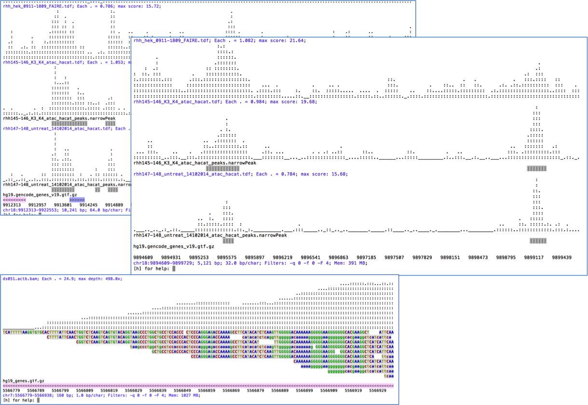
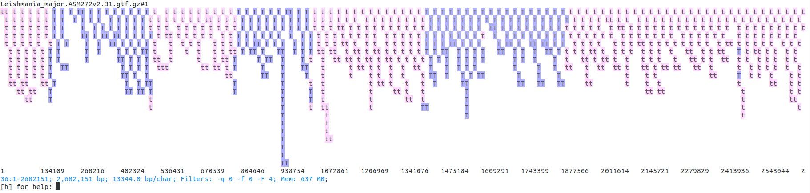
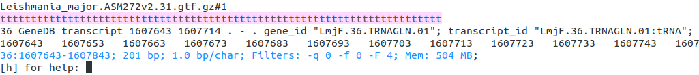

Text Only Genome Viewer!
========================

- [Description](#description)
- [Requirements and Installation](#requirements-and-installation)
    - [Installation quick start](#installation-quick-start)
    - [Installation through Homebrew](#installation-through-homebrew)
    - [A little more detail](#a-little-more-detail)
- [Usage examples](#usage-examples)
    - [Minimal example](#minimal-example)
    - [Open and browse](#open-and-browse)
    - [Finding & filtering stuff](#finding--filtering-stuff)
    - [Chaining commands](#chaining-commands)
    - [Batch processing](#batch-processing)
- [Supported input](#supported-input)
- [Genome option](#genome-option)
- [Formatting of reads and features](#formatting-of-reads-and-features)
- [Saving screenshots](#saving-screenshots)
- [Tips gotchas and miscellanea](#tips-gotchas-and-miscellanea)
- [Interactive commands](#interactive-commands)
- [Credits](#credits)


<!-- 
MEMO: Compile, package and upload to github releases
- Write-out jar from Eclipse
cd ~/svn_git/ASCIIGenome/trunk
mkdir ASCIIGenome-0.2.0 # This should match the version in ArgParse
cp ASCIIGenome ASCIIGenome-0.2.0/
cp /Users/berald01/Dropbox/Public/ASCIIGenome.jar ASCIIGenome-0.2.0/
zip -r ASCIIGenome-0.2.0.zip ASCIIGenome-0.2.0
rm -r ASCIIGenome-0.2.0

// Upload ASCIIGenome-0.2.0.zip to github releases and delete

 -->

Description
===========

`ASCIIGenome` is a command-line genome browser running from terminal window and solely based on
ASCII characters. Since `ASCIIGenome` does not require a graphical interface it is particularly
useful for  quickly visualizing genomic data on remote servers. The idea is to make `ASCIIGenome`
the Vim  of genome viewers.

As far as I know, the closest program to `ASCIIGenome` is [samtools tview](http://samtools.sourceforge.net/tview.shtml) but 
`ASCIIGenome` offers much more flexibility, similar to popular GUI viewers like [IGV](https://www.broadinstitute.org/igv/).

Some key features:

* Command line input and interaction, no graphical interface, minimal [installation and requirements](#requirements-and-installation)
* Can load multiple files in various [formats](#supported-input)
* Can access remote files via URL or ftp address
* Easy [navigation](#navigation) and [searching](#find) of features and sequence motifs and filtering options
* Support for BS-Seq alignment



Requirements and Installation
=============================

Installation quick start 
------------------------

In the commands below replace version number with the latest from [releases](https://github.com/dariober/ASCIIGenome/releases):

```
wget https://github.com/dariober/ASCIIGenome/releases/download/v0.1.0/ASCIIGenome-0.2.0.zip
unzip ASCIIGenome-0.2.0.zip

cd ASCIIGenome-0.2.0/
chmod a+x ASCIIGenome
cp ASCIIGenome.jar /usr/local/bin/ # Or ~/bin/
cp ASCIIGenome /usr/local/bin/     # Or ~/bin/ 
```

Installation through Homebrew
------------------------------

ASCIIGenome can also be installed through [brew](http://brew.sh/) / [Linux Brew](https://github.com/Linuxbrew/brew), although it is still not an official package:

```
brew install https://raw.githubusercontent.com/dariober/ASCIIGenome/master/install/brew/asciigenome.rb
```


A little more detail
--------------------

`ASCIIGenome.jar` requires **Java 1.7+** and this should be the only requirement. There is virtually no installation needed as `ASCIIGenome` is pure Java and should work on most (all?) platforms. Download the zip file `ASCIIGenome-x.x.x.zip` from [releases](https://github.com/dariober/ASCIIGenome/releases), unzip it and execute the jar file with

```
java -jar /path/to/ASCIIGenome.jar --help
```

To avoid typing `java -jar ...` every time, you can put both the helper 
script `ASCIIGenome` and the jar file ```ASCIIGenome.jar``` in the same directory in your `PATH` and execute with:

```
ASCIIGenome [options]
```

Note the helper is a bash script. To set the amount of memory available to java use the `-Xmx` option as e.g. `java -Xmx1500m -jar ...`.

If for some reason the text formatting misbehaves, disable it with the `-nf` option. I have developed 
ASCIIGenome on MacOS, Ubuntu and CentOS with `bash 4.1`, white colour background.

Usage examples
==============

These are just some functionalities to give an idea behind ASCIIGenome.

### Minimal example

Open an indexed bam file, as simple as:

```
ASCIIGenome aln.bam
```

Open with a reference genome (reference must be indexed, see [Supported input](#supported-input)):

```
ASCIIGenome -fa genome.fa aln.bam
```

### Open and browse 

Open some peak and bigWig files from
[ENCODE](http://hgdownload.cse.ucsc.edu/goldenPath/hg19/encodeDCC/wgEncodeSydhTfbs/). Note that
opening remote bigwig files is a little slow (IGV seems equally slow). You might also need to 
start Java with the option ` -Djava.net.useSystemProxies=true` (see also [issue#6](https://github.com/dariober/ASCIIGenome/issues/6)):

```
encode=http://hgdownload.cse.ucsc.edu/goldenPath/hg19/encodeDCC/wgEncodeSydhTfbs

ASCIIGenome -g hg19 \
    $encode/wgEncodeSydhTfbsGm10847NfkbTnfaIggrabPk.narrowPeak.gz \
    $encode/wgEncodeSydhTfbsGm10847NfkbTnfaIggrabSig.bigWig \
    $encode/wgEncodeSydhTfbsGm12892Pol2IggmusPk.narrowPeak.gz \
    $encode/wgEncodeSydhTfbsGm12892Pol2IggmusSig.bigWig
```

Find the first feature on the first file, then change colour of one of the tracks. Reset y axes to
span 0 to 50, finally save as png to default file name:

```
[h] for help: next #1
[h] for help: colorTrack magenta wgEncodeSydhTfbsGm12892Pol2IggmusSig
[h] for help: ylim 0 50
[h] for help: save .png
```

Result on terminal screen should look like this:


Saved file is `chr1_996137-1003137.png` (currently the png output doesn't include colours though).

### Finding & filtering stuff

Once started, ```ASCIIGenome``` makes it easy to browse the genome. The picture below shows the distribution of transcripts on chromosome 36 of *Leishmania major*. It is clearly visible how transcripts in *Leishmania* tend to be grouped in blocks transcribed from the same direction (blue: forward strand, pink: reverse strand). Note how overlapping features are stacked on top of each other.

This screenshot has been produced by first loading the *L. major* GTF file:

```
ASCIIGenome ftp://ftp.ensemblgenomes.org/pub/release-31/protists/gtf/leishmania_major/Leishmania_major.ASM272v2.31.gtf.gz
```

At command prompt issue the following commands:

```
[h] for help: goto 36:1-2682151
[h] for help: grep -i \ttranscript\t
[h] for help: trackHeight 100
```



Now return to the start of the chromosome and find the first feature containing *LmjF.36.TRNAGLN.01*,
print it to screen:

```
[h] for help: 1
[h] for help: find LmjF.36.TRNAGLN.01
[h] for help: print 
```

Now showing:



### Chaining commands

Commands need not to be executed one at a time but can be chained with the `&&` operator (like in Bash). This is more
convenient than executing commands one by one and it is also faster as tracks are processed only once. For example, the example above
could be executed in one pass as

```
goto 36:1-2682151 && grep -i \ttranscript\t && trackHeight 100
```

In addition, the same could be achieved at the start via the `--exec/-x` option:

```
ASCIIGenome -x 'goto 36:1-2682151 && grep -i \ttranscript\t && trackHeight 100' \
    ftp://ftp.ensemblgenomes.org/pub/release-31/protists/gtf/leishmania_major/Leishmania_major.ASM272v2.31.gtf.gz
```

### Batch processing

Often you have a list of regions to visualize in batch for a one or more tracks. For example, you have a list of ChIP-Seq peaks or RNA-Seq genes and you want to see the coverage profiles together with an annotation file. `ASCIIGenome` allows easy batch processing 
via the `--batchFile` option.

This script iterates through the intervals in *peaks.bed*. For each interval, it displays two bigiwig, a gtf file and the peak file itself. 
Each interval is zoomed out 3 times and the screenshot saved as png to `/tmp/peak.%r.png`, where `%r` is a special variable 
expanded to the current coordinates as `chrom_start-end`.

```
ASCIIGenome -b peaks.bed \
    -x 'zo 3 && save /tmp/peak.%r.png' \
    chipseq.bigwig \
    input.bigwig \
    gencode_genes.gtf \
    peaks.bed > /dev/null
```

[convert](http://www.imagemagick.org/script/convert.php) tools from ImageMagick is handy to concatenate png files and create 
a gallery of screenshots in a single file: 

```
convert -append /tmp/peak.*.png myPeaks.png
```

A similar task may be achieved by wrapping ASCIIGenome in a for-loop but it would much slower and complicated since each iteration would
require restarting the JVM and re-loading the tracks.

Supported input
===============

File name extensions matter as file types are usually recognized by their extension in case insensitive mode.
Reading remote files might require starting java with the option `-Djava.net.useSystemProxies=true` 
(see [issue#6](https://github.com/dariober/ASCIIGenome/issues/6)).

* **bam** files should be sorted and indexed, e.g. with `samtools sort` and `samtools index`. 
  Paths to remote URLs are supported but painfully slow (*IGV seems to suffer of the same issue*).
* **bigWig** recognized by extension `.bw` or `.bigWig`. Remote URLs supported.
* **bedGraph** recognized by extension `.bedGraph` or `.bedgraph`
* **bed**, **gtf**, **gff** recognized by respective extensions. Remote URLs supported. 
* **tdf** This is very useful for quickly displaying very large intervals like tens of megabases or entire chromosomes see [tdf](https://www.broadinstitute.org/igv/TDF)
* **vcf** Supported but not too sophisticated representation. URL should be supported but it appears ftp from 1000genomes doesn't work (same for IGV).
* All other extensions (e.g. txt, narrowPeak) will be treated as bed files, provided the format is actually bed!

All plain text formats (bed, bedgraph, etc) can be read as gzipped and there is no need to decompress them.

Bedgraph files should be sorted by position, a `sort -k1,1 -k2,2n` will do. Unindexed bedGraph files are first bgzipped and indexed to temporary files which are deleted on exit. This can take time for large files so consider creating the index once for all with [tabix](http://www.htslib.org/doc/tabix.html), *e.g.*

```
bgzip my.bedgraph &&
tabix -p bed my.bedgraph.gz
```

Bed & gtf file are not required to be sorted or index but in this case they are loaded in memory. To
save memory and time for large files you can again index them as above. Loading in memory is
typically fast for files of up to ~1/2 million records.

For input format specs see also [UCSC format](https://genome.ucsc.edu/FAQ/FAQformat.html) and for
guidelines on the choice of format see [IGV
recommendations](https://www.broadinstitute.org/igv/RecommendedFileFormats).

**Fasta reference**: The reference sequence should be uncompressed and indexed, with *e.g.* [samtools faidx](http://www.htslib.org/doc/samtools.html):

```
samtools faidx genome.fa
```

Notable formats currently **not** supported:  cram, bigBed. 

bigBed files can be converted to bgzip format with `bigBedToBed` from 
[UCSC utilities](http://hgdownload.soe.ucsc.edu/admin/exe/) and then indexed with tabix. For example:

```
bigBedToBed input.bb /dev/stdout/ | bgzip > input.bed.gz
tabix -p bed input.bed.gz
```

Genome option
=============

An optional genome file can be passed to option `-g/--genome` to give a set of allowed sequences and their sizes so that browsing is constrained to the real genomic space. 
The genome file is also used to represent the position of the current window on the chromosome, which is handy to navigate around.

There are three ways to pass a genome file:

* A tag identifying a built-in genome, e.g. hg19. See [genomes](https://github.com/dariober/ASCIIGenome/tree/master/resources/genomes) for available genomes

* A local file, tab separated with columns chromosome name and length. See [genomes](https://github.com/dariober/ASCIIGenome/tree/master/resources/genomes) for examples.

* A bam file with suitable header.

Note that if the input list of files contains a bam file, the `--genome` option is effectively ignored as the genome dictionary is extracted from the bam header.


Formatting of reads and features
================================

When aligned reads are show at single base resolution, read bases follow the same convention as samtools: 
Upper case letters and `.` for read align to forward strand, lower case and `,` otherwise; second-in-pair reads are underlined;
grey-shaded reads have mapping quality of <=5. 

GTF/GFF features on are coded according to the feature column as below. For forward strand 
features the colour blue and upper case is used, for reverse strand the colour is pink the case is lower. 
Features with no strand information are in grey.

Feature | Symbol
--------|-------
exon | E  
cds | C  
start_codon | A 
stop_codon | Z 
utr | U 
3utr | U 
5utr | W 
gene | G 
transcript | T 
mrna | M 
trna | X 
rrna | R 
mirna | I 
ncrna | L 
lncrna | L 
sirna | S 
pirna | P 
snorna | O 


If available, the feature name is shown on the feature itself. 
The feature name has a trailing underscore to separate it from the rest of the feature representation. The
last character of the feature is always the feature type. For example, the feature named `myGene` appears as:

```
myGene_EEEEEEEEE ## Enough space for the full name
myGenE           ## Not enough space, name truncated and last char is E
```

For BED features, name is taken from column 4, if available. Default for GTF/GFF is to take name from attribute 
`Name`, if absent try: `ID`, `transcript_name`, `transcript_id`, `gene_id`, `gene_name`. 
To choose an attribute see command `gffNameAttr`.

Read coverage tracks at single base resolution show the consensus sequence obtained from the underlying reads. If
the reference fasta file is present the `=` symbol is used to denote a match. Heterozygote bases or variants are shown 
using the [iupac ambiguity codes](http://www.bioinformatics.org/sms/iupac.html) for up to two variants (N otherwise).
Variants are called with a not-too-sophisticated heuristics: Only base qualities >= 20 are considered, an alternative allele
is called if supported by at least 3 reads and makes up at least 1% of the total reads. The first and second allele must make at least 
98% of the total reads otherwise the base is N (see `PileupLocus.getConsensus()` for exact implementation). Insertion/deletions
are currently not considered.

Saving screenshots
==================

Screenshots can be saved to file with the commands `save`. Output format is either ASCII text or
png, depending on file name extension. For example:

```
[h] for help: save mygene.txt ## Save to mygene.txt as text
[h] for help: save            ## Save to chrom_start-end.txt as text
[h] for help: save .png       ## Save to chrom_start-end.png as png
[h] for help: save mygene.png ## Save to mygene.png as png
```

Without arguments, `save` writes to file named after the current  genomic position e.g.
`chr1_1000-2000.txt`.  The ANSI formatting (*i.e.* colours) is stripped before saving so that files
can be viewed on any text editor (use a monospace font like `courier`).

Screenshots can be saved also in **non-interactive mode**. Since ASCIIGenome prints to stdout you just
need to use the redirection operator `>` together with options `-ni` (non-interactive) and `-nf` (no
formatting). For example: save to `view.txt` the region *chr1:100000-102000*, set mapping quality 
threshold to 10 and track height to 5:

```
ASCIIGenome -r chr1:100000-102000 -x 'mapq 10 && trackHeight 5' -nf -ni aln.bam dat.bigwig > view.txt
```

This is handy to embed ASCIIGenome in scripts or to generate several screenshots in batch. For example
using for-loops.

```
for reg in chr1:1000-2000 chr18:2000-3000 chr21:5000-8000
do
    ASCIIGenome -r $reg -nf -ni input.bed input.bw >> regs.txt
done
```

Alternatively images could be saved to png using `-x 'save .png'` option.

Tips gotchas and miscellanea
============================

* **Performance** Alignment files are typically accessed very quickly but `ASCIIGenome` becomes slow
when the window size grows above a few hundreds of kilobases. Annotation files (bed, gff, gtf) are
loaded in memory unless they are indexed with `tabix`.

* **Regular expression** Use the `(?i)` modifier to match in case insensitve mode, e.g. '(?i).*actb.*'

* When displaying bam files, `ASCIGenome` is hardcoded to disable the coverage and read tracks if
the window size is >100,000 bp. This is to prevent the browsing to become horribly slow. To display
such large windows  consider bigWig or tdf file format.

* When opening bam files, the first chromosome is often the mitochondrial chromosome chrM (or chrMT) which
often has very high read depth (say 10,000x). This can make the opening slow. Consider using the `-r`
option in these cases. E.g. `ASCIIGenome -r chr1 file1.bam file2.bam ...`

Interactive commands
====================

*The description of each interactive commands is [here](commandHelp.md)*

As there is no GUI, everything is handled thorough command line. Once `ASCIIGenome` is started enter
a command and press ENTER to execute.

Some features of Unix console are enabled: 

* Arrow keys UP and DOWN scroll previous commands.
* TAB auto-completes commands.
* ENTER without any argument repeats the previous command.

Examples:

```
[h] for help: ff <ENTER>   ## Move forward
[h] for help: <ENTER>      ## Move forward again...
[h] for help: <ENTER>      ## ... and again
[h] for help: col <TAB>    ## Is expanded to colorTrack
[h] for help: <ARROW UP>   ## Shows previous command
[h] for help: h <ENTER>    ## Show help.
```

When track names are passed as arguments, it is not necessary to  give the full name as
partial matching is enabled. This is handy since track names have an ID appended as suffix which can
be used in place of the full name, e.g. `next myLongfileName.bed#1` can be also typed as `next #1`.

Credits
=======

* Bam processing is mostly done with the [samtools/htsjdk](https://github.com/samtools/htsjdk) library.
* Bigwig and tdf are processed with classes from [IGV](https://github.com/igvteam/igv) source code.
* Block compression and indexing done using [jvarkit](https://github.com/lindenb/jvarkit).
* Brew installation thanks to [dalloliogm](https://github.com/dalloliogm).
