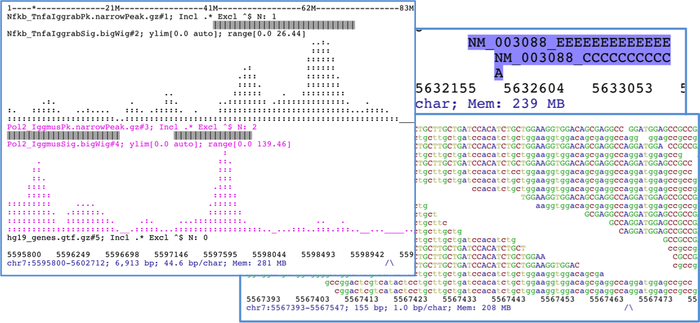

Description
===========

.. .. raw:: html

..     <iframe width="560" height="315" src="https://www.youtube.com/embed/vE58EOT7VKw?rel=0" frameborder="0" allowfullscreen></iframe>

`ASCIIGenome` is a command-line genome browser running from terminal window and solely based on
ASCII characters. Since `ASCIIGenome` does not require a graphical interface it is particularly
useful for  quickly visualizing genomic data on remote servers. The idea is to make `ASCIIGenome`
the Vim  of genome viewers.

The closest program to `ASCIIGenome` is probably `samtools tview <http://samtools.sourceforge.net/tview.shtml>`_ but 
`ASCIIGenome` offers much more flexibility, similar to popular GUI viewers like the `IGV browser <https://www.broadinstitute.org/igv/>`_.

Some key features:

* Command line input and interaction, no graphical interface, minimal installation.
* Can load multiple files in various [formats](#supported-input).
* Can access remote files via URL or ftp address.
* Easy navigation and searching of features and sequence motifs and filtering options.
* Support for BS-Seq alignment.

Support
-------

Any and all comments, bugs and issues can be reported on `GitHub <https://github.com/dariober/ASCIIGenome/issues>`_ or by posting a question on `Biostars.org <https://www.biostars.org/>`_ with tag ASCIIGenome.

How to cite
-----------

If you happen to find `ASCIIGenome` useful and you would like to acknowledge it, please quote the
GitHub repository (https://github.com/dariober/ASCIIGenome/). A manuscript describing `ASCIIGenome` is
in preparation.

Credits
-------

* Bam processing is mostly done with the `samtools/htsjdk <https://github.com/samtools/htsjdk>`_ library.
* Bigwig and tdf are processed with classes from `IGV <https://github.com/igvteam/igv>`_ source code.
* Block compression and indexing done using `jvarkit <https://github.com/lindenb/jvarkit>`_.
* Brew installation thanks to `dalloliogm <https://github.com/dalloliogm>`_.

.. image:: screenshots/ex3.png