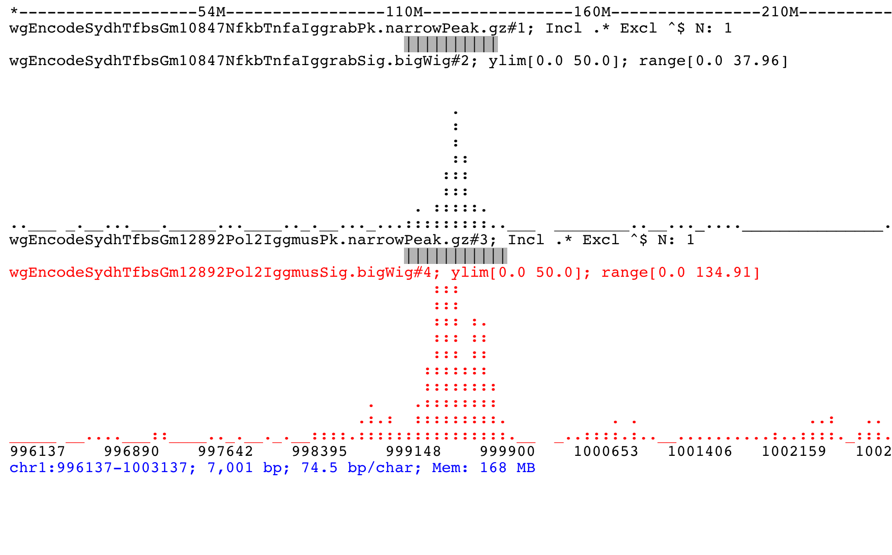
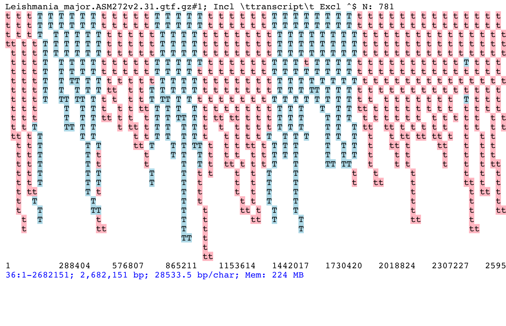
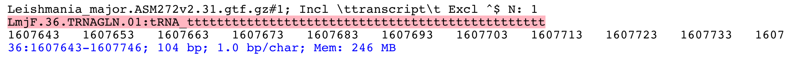
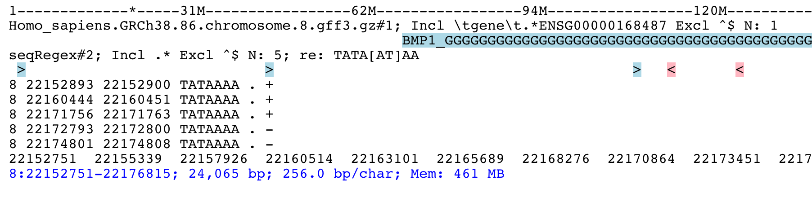

Examples
========

Video clips
-----------

These short clips should give just a feel for how *ASCIIGenome* works in interactive
mode.

.. raw:: html

    <iframe width="640" height="360" src="https://www.youtube.com/embed/8p753IcdImI" frameborder="0" allowfullscreen></iframe>

This example loads a bam file and shows the read track at the bottom
and the coverage track on top. After loading the bam file, the follow operations
are executed at the command prompt:
 
* Go to specified region.

* Zoom in.

* Repeatedly move forward by half a window size.

* Zoom out.

* Filter reads using samtools-like syntax.

----

.. raw:: html

    <iframe width="640" height="360" src="https://www.youtube.com/embed/gaXdrePaB80" frameborder="1" allowfullscreen></iframe>

Here there are two bigWig files of ChIP-Seq profiles. The corresponding peak regions
are separately loaded. The following operations are executed at the command prompt:

* Change track height to 12 lines each.

* Add two *narrowPeak* files, captured with the glob :code:`*.narrowPeak.gz`.

* Re-order tracks.

* Zoom out.

* Hide title lines.

* Change limits of the Y-axes to be from 0 to maximum of all tracks.

* Move to the next bed feature.

* Show help for the :code:`ylim` command.

Why the command line
--------------------

At first it may be nonsensical to use a viewer without graphical interface. In
addition, typed commands involve a steeper learning curve and more frustration.
However, the command line interface has some great benefits which, at least in
part, explain why most bioinformaticians prefer R, python and Unix tools over
Excel and Galaxy (which are great, by the way, just like IGV is great). Some advantages 
of the command line interface over the GUI:

* Streamline repetitive tasks.

* Finer control of the commands.

* Self-documented and therefore reproducible.

This example should illustrate these points. For a start, most of my data files,
especially the big ones, live on the institutes's computer cluster or on our
group server. Almost nothing is stored on my workstation. Consequently pretty
much all the work I do is via Unix commands, bash and the familiar samtools, bedtools,
etc.  Popping up a GUI is often a disturbance of the workflow so having a
visualisation tool with the same interface (*i.e.* command line) as these tools
is more natural.

Now, say we want to visualise the following files::

    ts058_TS10-PEO1-Pt-A2.tdf 
    ts059_TS10-PEO1-Pt-A4.tdf 
    ts060_TS11-PEO1-DMF-A13.tdf 
    ts061_TS11-PEO1-Pt-A12.tdf 
    ts062_TS11-PEO1-Pt-A7.tdf 
    ts063_TS11-PEO4-DMF-A5.tdf 
    ts064_TS11-PEO4-Pt-A2.tdf 
    ts065_TS11-PEO4-Pt-A4.tdf 
    ts069_PEO1-DMF-A5.tdf 
    ts070_PEO1-Pt-A18.tdf 
    ts071_PEO1-Pt-A2.tdf

Loading all these files by clinking one by one through a GUI can be annoying
especially if they  are in different directories, not counting the time spent to
pop up the GUI and scroll through the relevant menus. With *ASCIIGenome* you can
probably just do one of the following::

    ASCIIGenome ts0{58..71}*.tdf
    ASCIIGenome *PEO1*.tdf *PEO4*.tdf
    ASCIIGenome `find . -name '*PEO*.tdf'` ## If files are in different subdirs
    ASCIIGenome ts058_TS10-PEO1-Pt-A2.tdf ts059_TS10-PEO1-Pt-A4.tdf <etc>

The command line you have used can be copied in your documentation for reference and it can 
be used again by copying and pasting it to the terminal. 

Once these files have been loaded you may want to order them to have the PEO1 
tracks before the PEO4s. This is just::
    
    orderTracks PEO1 PEO4

Similarly, settings can be changed without the need of scrolling through
menu options, for example::

    colorTrack blue PEO1   <- Turn blue the PEO1 tracks
    trackHeight 10 DMF     <- Make 10 lines high the tracks matching DMF

Furthermore, the commands issued at the prompt can be scrolled with the UP and DOWN arrow
keys. So if we want to change the colour of the PEO1 tracks again we just need to press UP two times,
bring back the :code:`colorTrack blue PEO1` command, and edit it as required.

We can put this together in a single command which, again, can go to the documentation::

    ASCIIGenome -x 'orderTracks PEO1 PEO4 && colorTrack blue PEO1 && trackHeight 10 DMF' ts0{58..71}*.tdf

Open and browse 
---------------

Open some peak and bigWig files from
`ENCODE <http://hgdownload.cse.ucsc.edu/goldenPath/hg19/encodeDCC/wgEncodeSydhTfbs/>`_. 

.. note:: Opening remote files is a little slow (IGV seems equally slow). You might also need to  start Java with the option `-Djava.net.useSystemProxies=true` (see also `issue#6 <https://github.com/dariober/ASCIIGenome/issues/6>`_)

::

    encode=http://hgdownload.cse.ucsc.edu/goldenPath/hg19/encodeDCC/wgEncodeSydhTfbs

    ASCIIGenome -g hg19 \
        $encode/wgEncodeSydhTfbsGm10847NfkbTnfaIggrabPk.narrowPeak.gz \
        $encode/wgEncodeSydhTfbsGm10847NfkbTnfaIggrabSig.bigWig \
        $encode/wgEncodeSydhTfbsGm12892Pol2IggmusPk.narrowPeak.gz \
        $encode/wgEncodeSydhTfbsGm12892Pol2IggmusSig.bigWig

Find the first feature on the first file, then change colour of one of the tracks. Reset y axes to
span 0 to 50, finally save as pdf to default file name::

    [h] for help: next #1
    [h] for help: colorTrack red wgEncodeSydhTfbsGm12892Pol2IggmusSig
    [h] for help: ylim 0 50
    [h] for help: save %r.pdf

Result on terminal screen should look like this:

The file is to *chr1_996137-1003137.pdf*, note that the variable :code:`%r` is expanded to the genomic coordinates.

Finding & filtering stuff
-------------------------

Once started, :code:`ASCIIGenome` makes it easy to browse the genome. The picture below shows the distribution of transcripts on chromosome 36 of *Leishmania major*. It is clearly visible how transcripts in *Leishmania* tend to be grouped in blocks transcribed from the same direction (blue: forward strand, pink: reverse strand). Note how overlapping features are stacked on top of each other.

This screenshot has been produced by first loading the *L. major* GTF file::

    ASCIIGenome ftp://ftp.ensemblgenomes.org/pub/release-31/protists/gtf/leishmania_major/Leishmania_major.ASM272v2.31.gtf.gz

At the command prompt issue the following commands::

    [h] for help: goto 36:1-2682151
    [h] for help: grep -i transcript
    [h] for help: trackHeight 100

Now return to the start of the chromosome and find the first feature containing *LmjF.36.TRNAGLN.01*,
print it to screen::

    [h] for help: 1
    [h] for help: find LmjF.36.TRNAGLN.01
    [h] for help: print 

Now showing:

.. _Batch-processing:

Batch and non-interactive mode
------------------------------

*ASCIIGenome* can be integrated in a script to be executed without direct human
intervention. For example, a simple bash script may contain the following
commands::

    #!/bin/bash

    ## Find ChIP-Seq peaks
    CHIP=ChIP.bam
    macs2 callpeak -t $CHIP -c input.bam -n out

    ## Output pdf in a "control" region for later visual inspection
    ASCIIGenome -ni -r chr1:1000000-1020000 -x "save ${CHIP}.ctrl.pdf" \
        $CHIP input.bam out_peaks.narrowPeak > /dev/null

In this script, a ChIP-Seq sample is first analysed to find peaks against an
input  control. ChIP, input and output from the peak caller are then loaded in
*ASCIIGenome*  to visualize a region of interest. *ASCIIGenome* will save the
image in  pdf file named after the ChIP sample and exit. An investigator can
later inspect  the pdf figure to assess the quality of the ChIP or to check
whether a peak has been detected.

The example above can easily be extended to several regions to be visualised in
batch for one or more tracks. For example, you have a list of ChIP-Seq peaks or
RNA-Seq genes and you want to see the coverage profiles together with an
annotation file. :code:`ASCIIGenome` allows batch processing  via the
:code:`--batchFile/-b` option.

This script iterates through the intervals in *peaks.bed*. For each interval, it displays two
bigWig, a gtf file and the peak file itself.  Each interval is zoomed out 3 times and the screenshot
saved as pdf to :code:`/tmp/peak.%r.pdf`, where `%r` is a special variable  expanded to the current
coordinates as `chrom_start-end`.::

    ASCIIGenome -b peaks.bed \
        -x 'zo 3 && save /tmp/peak.%r.pdf' \
        chipseq.bigwig \
        input.bigwig \
        gencode_genes.gtf \
        peaks.bed > /dev/null

To save all the screenshots in a single pdf use the >> operator in the *save* command, *e.g.* :code:`save >> myScreenshots.pdf`.

Finding sequence motifs
-----------------------

The reference fasta sequence can be searched for sequence motifs specified via regular expressions 
or via `IUPAC notation <https://en.wikipedia.org/wiki/Nucleic_acid_notation#IUPAC_notation>`_. 

This example is from `Biostars <https://www.biostars.org/p/221325/>`_. We want to find matches of
the motif TATAWAA near gene ENSG00000168487.

First load the reference sequence and a (remote) annotation file::

    ASCIIGenome -fa Homo_sapiens.GRCh38.dna.chromosome.8.fa \
        ftp://ftp.ensembl.org/pub/release-86/gff3/homo_sapiens/Homo_sapiens.GRCh38.86.chromosome.8.gff3.gz

Then at the command prompt issue these commands::

    find ENSG00000168487
    grep -i \tgene\t.*ENSG00000168487 gff3
    seqRegex -iupac TATAWAA
    zo 8
    print seqRegex
    print seqRegex > matches.bed
    save matches.png

Explained: Find the gene ENSG00000168487, for clarity only show the "gene" feature (:code:`grep...`). 
Then search the motif TATAWAA interpreted as iupac notation; zoom out *x* times (e.g. 8 times) to see some
matches in the sequence.

The matches here are shown on screen with :code:`print seqRegex` and then saved to file with :code:`print seqRegex > matches.bed`. Finally save a picture as png, shown here:

