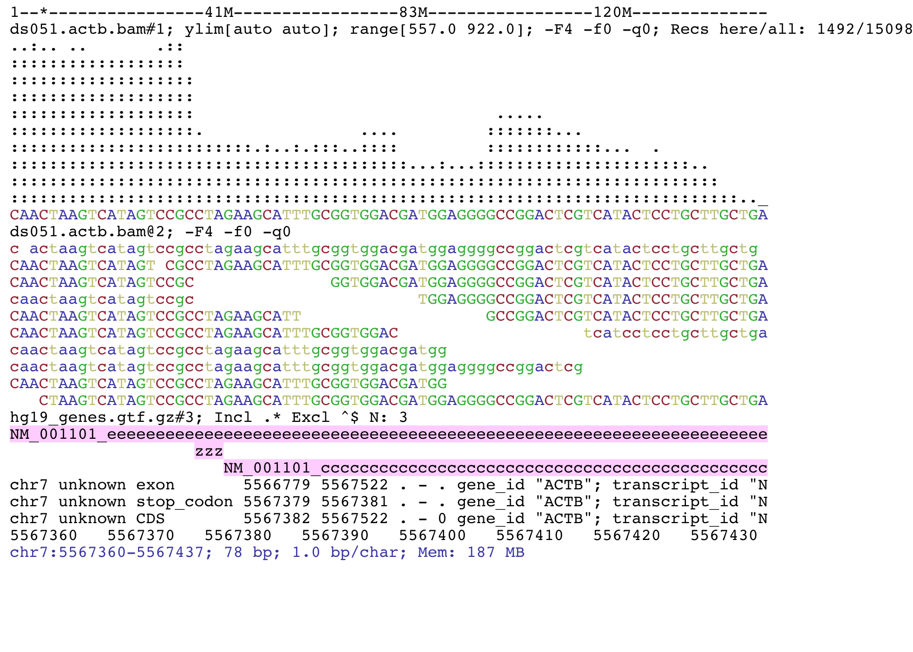
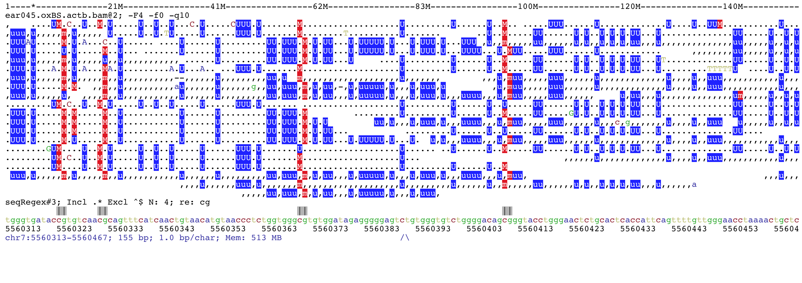

.. _Supported_input_and_output:

Input and output
================

Input file formats
------------------

File name extensions matter as file types are usually recognized by their extension. Reading remote files might require starting java with the option
:code:`-Djava.net.useSystemProxies=true`  (see `issue#6 <https://github.com/dariober/ASCIIGenome/issues/6>`_). 

Unless noted otherwise remote URL links are supported. However, there are issues 
reading tabix files on ftp servers (http are ok), see 
`htsjdk/issue#797 <https://github.com/samtools/htsjdk/issues/797>`_. Reading such files is
possible but ASCIIGenome will first download them locally.   

.. csv-table::
   :header: "Format", "Extension", "Notes"
   :widths: 10, 10, 40

   "", "*Annotation*", ""
   "`gtf <http://gmod.org/wiki/GFF2>`_, `gff <http://gmod.org/wiki/GFF3>`_", ":code:`.gtf .gff .gff3`", "Can be gzipped (:code:`.gz`)"
   "`bigBed <http://genome.ucsc.edu/goldenPath/help/bigBed.html>`_", ":code:`.bb .bigBed`", ""
   "`bed <http://www.ensembl.org/info/website/upload/bed.html>`_", "Any", "Can be gzipped (:code:`.gz`)"
   "", "*Quantitative*", ""
   "`bigWig <https://genome.ucsc.edu/goldenpath/help/bigWig.html>`_", ":code:`.bigWig .bw`", ""
   "`bedGraph <https://genome.ucsc.edu/goldenpath/help/bedgraph.html>`_", ":code:`.bedGraph`", "Can be gzipped (:code:`.gz`)"
   "`tdf <https://www.broadinstitute.org/igv/TDF>`_", ":code:`.tdf`", "Useful for quantitative data on very large intervals."
   "", "*Other*", ""
   "`vcf <https://en.wikipedia.org/wiki/Variant_Call_Format>`_", ":code:`.vcf`", "Can be gzipped (:code:`.gz`)"
   "`bam <https://samtools.github.io/hts-specs/SAMv1.pdf>`_", ":code:`.bam`", "Must be Sorted and indexed. 

   Remote URLs are painfully slow (*same for IGV*)." 

Note that the recognition of the extension is *case insensitive*, so *.bigBed* is the 
same as *.bigbed*.

A notable format currently **not** supported is CRAM.

.. tip:: For input format specs see also `UCSC format <https://genome.ucsc.edu/FAQ/FAQformat.html>`_ and `Ensembl <http://www.ensembl.org>`_.  
         For guidelines on the choice of format see the `IGV recommendations <https://www.broadinstitute.org/igv/RecommendedFileFormats>`_.

Please see `issue #2 <https://github.com/dariober/ASCIIGenome/issues/2>`_ and `issue #41 <https://github.com/dariober/ASCIIGenome/issues/41>`_
about reading remote tabix files (*to be resolved*).

.. _handling_large_files:

Handling large files
++++++++++++++++++++

ASCIIGenome always makes use of indexing to access data so that the memory usage stays low even for large
files. Tabular data files (bed, gtf/gff, bedgraph, etc) which are not block compressed and indexed
are first sorted, compressed and indexed to temporary working files. This is usually quick for files of
up to 1/2 million rows. For larger files consider compressing them with external utilities such as 
`tabix <http://www.htslib.org/doc/tabix.html>`_. For example, to sort, compress and index a bed
file::

    sort -k1,1 -k2,2n my.bed \
    | bgzip > my.bed.gz
    tabix -p bed my.bed.gz

Setting a genome
----------------

An optional genome file can be passed to option :code:`-g/--genome` or set with the
:code:`setGenome` command to give a set of allowed sequences and their sizes so that browsing is
constrained to the real genomic space.  The genome file is also used to represent the position of
the current window on the chromosome, which is handy to navigate around.

There are different ways to set a genome:

* A tag identifying a built-in genome, e.g. hg19. 
  See `genomes <https://github.com/dariober/ASCIIGenome/tree/master/resources/genomes>`_ for available genomes.

* A local file, tab separated with columns chromosome name and length. 
  See `genomes <https://github.com/dariober/ASCIIGenome/tree/master/resources/genomes>`_ for examples.

* A bam file with suitable header.

* A fasta reference sequence (see :ref:`Fasta-reference-sequence`).

.. _Fasta-reference-sequence:

Reference sequence
++++++++++++++++++

A reference sequence file is optional. If provided, it should be in fasta format,
and uncompressed. If the fasta file does not have an index, *ASCIIGenome* will 
create a temporary index file that will be deleted on exit. A permanent index can
be created with::

    samtools faidx ref.fa 

Output
------

Formatting of reads and features
++++++++++++++++++++++++++++++++

When aligned reads are show at single base resolution, read bases follow the same convention as
samtools:  Upper case letters and :code:`.` for read align to forward strand, lower case and
:code:`,` otherwise; second-in-pair reads are underlined; grey-shaded reads have mapping quality of <=5.

GTF/GFF features on are coded according to the feature column as below. For forward strand  features
the colour blue and upper case is used, for reverse strand the colour is pink and the case is lower.
Features with no strand information are in grey.

===========  ======
Feature      Symbol
===========  ======
exon         E  
cds          C  
start_codon  A 
stop_codon   Z 
utr          U 
3utr         U 
5utr         W 
gene         G 
transcript   T 
mrna         M 
trna         X 
rrna         R 
mirna        I 
ncrna        L 
lncrna       L   
sirna        S 
pirna        P 
snorna       O 
===========  ======

This is an example of a BAM file and a GTF file. The top track shows the read coverage, the middle
track the aligned reads and the bottom track the GTF features in this genomic window.

If available, the feature name is shown on the feature itself. For BED features, name is taken from column 4, if available. Default for GTF/GFF is to take name
from attribute  :code:`Name`, if absent try: :code:`ID`, :code:`transcript_name`,
:code:`transcript_id`, :code:`gene_id`, :code:`gene_name`.  To choose an attribute see command
:code:`gffNameAttr`.

Read coverage tracks at single base resolution show the consensus sequence obtained from the
underlying reads. If the reference fasta file is present the :code:`=` symbol is used to denote a
match. Heterozygote bases or variants are shown  using the `iupac ambiguity codes <http://www.bioinformatics.org/sms/iupac.html>`_ for up to two variants (N otherwise). Variants
are called with a not-too-sophisticated heuristics: Only base qualities >= 20 are considered, an
alternative allele is called if supported by at least 3 reads and makes up at least 1% of the total
reads. The first and second allele must make at least  98% of the total reads otherwise the base is
N (see :code:`PileupLocus.getConsensus()` for exact implementation). Insertion/deletions are
currently not considered.

Title lines
+++++++++++

The title lines contains information about the track and their content depends on the track type.

For all tracks, the title line shows the file name (*e.g.* :code:`hg19_genes_head.gtf.gz`) with appended an identifier (*e.g.* :code:`#3`).
The filename and the identifier together make the name of the track. All commands 
operating on tracks use this name to select tracks. The suffix identifier is handy
to capture tracks without giving the full track name.

Annotation tracks (bed, gtf, gff, vcf)
^^^^^^^^^^^^^^^^^^^^^^^^^^^^^^^^^^^^^^

Example:

:code:`hg19_genes_head.gtf.gz#1; N: 13; grep -i exon -e CDS`

After the track name (:code:`hg19_genes_head.gtf.gz#1`), the title shows the number of features
in the current window (:code:`N: 13`). Other information is shown depending on the track
settings. In this example the title shows settings used to filter in and out features (:code:`grep ...`).

Quantitative data
^^^^^^^^^^^^^^^^^

This title type applies to quantitative data such as bigwig and tdf and to the read 
coverage track.

Example:

:code:`ear045.oxBS.actb.bam#2; ylim[0.0 auto]; range[44.0 78.0]; Recs here/all: 255/100265; samtools -q 10`

Explanation:

:code:`ear045.oxBS.actb.bam#2`: Track name as described above

:code:`ylim[0.0 auto]` limits of the y-axis, here from 0 to the maximum of this window. 

:code:`range[44.0 78.0]` Range of the data on the y-axis. 

:code:`Recs here/all: 255/100265` number of alignments present in this window (255) versus the 
total number in the file (100265). 

:code:`samtools -q 10` information about mapping quality and bitwise filter set with the `samtools` command. 
omitted if not applicable and if no filter is set. See also `explain sam flag <https://broadinstitute.github.io/picard/explain-flags.html>`_.

Read track
^^^^^^^^^^

This is the track showing individual reads. Example:

:code:`ear045.oxBS.actb.bam@3; samtools -q 10`

:code:`ear045.oxBS.actb.bam@3` As before, this is the track name composed of file name and 
track ID. In contrast to other tracks, the id starts with *@* instead of *#*. This is
handy to capture all the read tracks but not the coverage tracks, for example *trackHeight 10 bam@* applies
to all the read tracks but not to the coverage tracks.

Saving screenshots
------------------

Screenshots can be saved to file with the commands :code:`save`. Output format is either ASCII text or
pdf, depending on file name extension. For example::

    [h] for help: save mygene.txt ## Save to mygene.txt as text
    [h] for help: save            ## Save to chrom_start-end.txt as text
    [h] for help: save .pdf       ## Save to chrom_start-end.pdf as pdf
    [h] for help: save mygene.pdf ## Save to mygene.pdf as pdf

Without arguments, :code:`save` writes to file named after the current  genomic position e.g.
`chr1_1000-2000.txt`.  The ANSI formatting (*i.e.* colours) is stripped before saving so that files
can be viewed on any text editor (use a monospace font like :code:`courier`). For convenience the 
variable :code:`%r` in the file name is expanded to the current genomic coordinates, for example 
`save mygene.%r.pdf` is expanded to *e.g.* :code:`mygene.chr1_1000_2000.pdf`. 

See also :ref:`Batch-processing` for saving screenshots in batch by iterating through a list of
positions.

This is a screenshots of bisulfite-seq data. The `BSseq` mode was set and methylated cytosines are shown in red while unmethylated cytosines in blue. 

